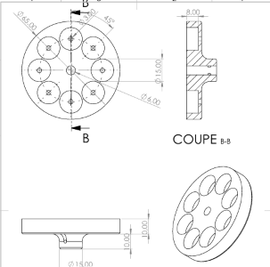
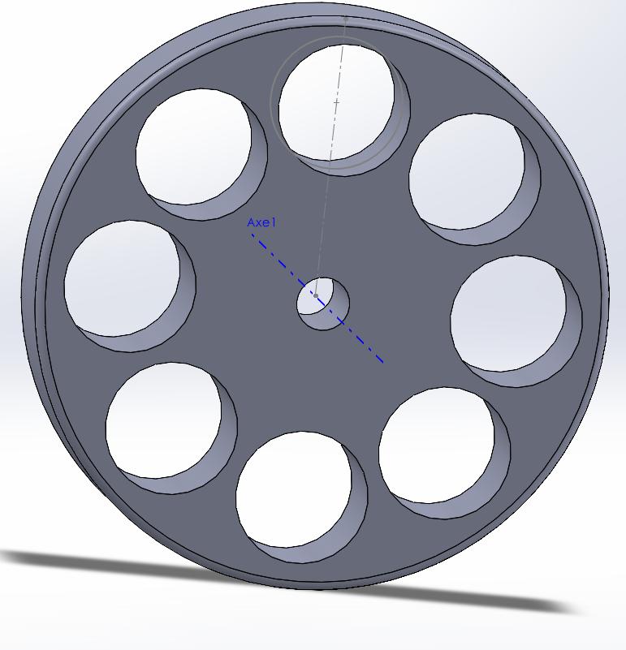

<h2>🎨 Concevoir</h2>

<h3>
  <a href="https://www.solidworks.com/fr/lp/proven-solution-3d-design-and-product-development" target="_blank">
    🛠️ Utilisation de SolidWorks pour la conception du moteur de drone
  </a>
</h3>

  Dans le cadre du projet <strong>SAE Moteur de Drone</strong>, j'ai utilisé SolidWorks pour concevoir le rotor et le stator du moteur à partir d’un plan de conception. 
  Cette étape a été cruciale pour assembler les composants et garantir leur compatibilité, notamment pour accueillir les aimants. Voici ce que j’ai appris et réalisé :

<ul>
  <li><strong>Création de cotes et modélisation 3D :</strong> Définition précise des dimensions de chaque pièce pour assurer un assemblage parfait.</li>
  <li><strong>Conception du rotor et du stator :</strong> Modélisation 3D à partir d’un plan initial, en optimisant la conception pour la fabrication.</li>
  <li><strong>Assemblage virtuel :</strong> Vérification du fonctionnement global en assemblant virtuellement les composants.</li>
</ul>

  
  

  À partir du plan de conception (patron), en tenant compte des cotes indiquées, j’ai réalisé en 3D le rotor, le stator, 
  ainsi que d'autres pièces du moteur à l’aide de SolidWorks.

<h3>📽️ Vidéo du stator modélisé</h3>

<video width="100%" controls preload="auto" muted>
  <source src="videos/Le stator.mp4" type="video/mp4">
  Votre navigateur ne supporte pas la vidéo HTML5.
</video>
